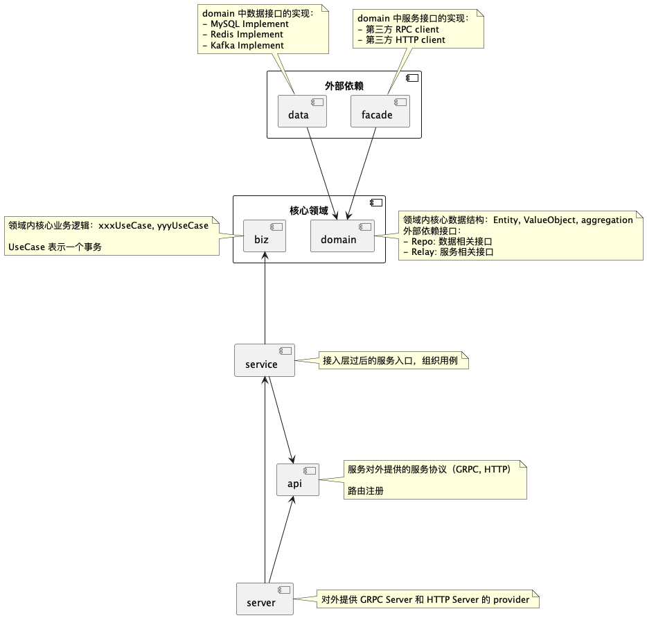

# Layered Architecture Patterns

## Overview




## Directory Structure

```
├── api
│   └── ppm
│       └── v1
│           ├── error_reason_errors.pb.go
│           ├── error_reason.pb.go
│           ├── error_reason.proto
│           ├── plugin_grpc.pb.go
│           ├── plugin_http_admin.go
│           ├── plugin_http_client.go
│           ├── plugin_http.go
│           ├── plugin.pb.go
│           ├── plugin.proto
│           ├── ppm_http.go
│           └── router.go
├── app
│   └── ppm
├── cmd
│   ├── ppm
│   │   ├── main.go
│   │   ├── wire_gen.go
│   │   └── wire.go
│   └── ppm-cli
│       ├── internal
│       │   ├── db
│       │   └── devtool
│       ├── main.go
│       └── version.go
├── configs
│   └── ca_cert.pem
├── Dockerfile
├── go.mod
├── go.sum
├── internal
│   ├── biz
│   │   ├── biz.go
│   │   ├── f_stop_step_factory.go
│   │   ├── f_uninstall_step_factory.go
│   │   ├── h_ppm_load_plg.go
│   │   ├── h_ppm_remove_plg.go
│   │   ├── h_ppm_resume_plg.go
│   │   ├── h_ppm_start_plg.go
│   │   ├── h_ppm_stop_plg.go
│   │   ├── h_ppm_uninstall_plg.go
│   │   ├── h_ppm_upgrade_plg.go
│   │   ├── hf_pkg.go
│   │   ├── hf_plg.go
│   │   ├── ppm_task_mw.go
│   │   ├── README.md
│   │   ├── uc_auth.go
│   │   ├── uc_plg_install_log.go
│   │   ├── uc_plg_install.go
│   │   ├── uc_plg.go
│   │   └── uc_ppm.go
│   ├── conf
│   │   ├── conf.pb.go
│   │   └── conf.proto
│   ├── data
│   │   ├── data.go
│   │   ├── kafka
│   │   │   ├── conn.go
│   │   │   ├── reader.go
│   │   │   └── writer.go
│   │   ├── model
│   │   │   ├── db.go
│   │   │   ├── plugin_install_log.go
│   │   │   ├── plugin_install.go
│   │   │   ├── plugin_pkg.go
│   │   │   ├── plugin.go
│   │   │   ├── ppm_task_log.go
│   │   │   └── ppm_task.go
│   │   ├── mq_pc_leave_domain.go
│   │   ├── mq_plugin_status.go
│   │   ├── README.md
│   │   ├── redis
│   │   │   ├── base.go
│   │   │   ├── key.go
│   │   │   └── redis.go
│   │   ├── repo_pkg.go
│   │   ├── repo_plugin_db_manager.go
│   │   ├── repo_plugin_install_log.go
│   │   ├── repo_plugin_install.go
│   │   ├── repo_plugin.go
│   │   ├── repo_ppm_task_log.go
│   │   └── repo_ppm_task.go
│   ├── domain
│   │   ├── docker.go
│   │   ├── fact_step.go
│   │   ├── http_platform.go
│   │   ├── k8s_options.go
│   │   ├── k8s.go
│   │   ├── mq_pc.go
│   │   ├── plg_env_key.go
│   │   ├── plg_env_test.go
│   │   ├── plg_env.go
│   │   ├── plg_install_log.go
│   │   ├── plg_install.go
│   │   ├── plg_mq.go
│   │   ├── plg_pkg_manifest.go
│   │   ├── plg_pkg.go
│   │   ├── plg.go
│   │   ├── ppm_task_log.go
│   │   ├── ppm_task.go
│   │   ├── README.md
│   │   ├── rpc_apiauth.go
│   │   ├── rpc_license.go
│   │   ├── rpc_platform.go
│   │   └── rpc_rms.go
│   ├── facade
│   │   ├── docker_test.go
│   │   ├── docker.go
│   │   ├── facade.go
│   │   ├── http_platform.go
│   │   ├── k8s_helper.go
│   │   ├── k8s_test.go
│   │   ├── k8s.go
│   │   ├── proto
│   │   │   ├── apiauth
│   │   │   ├── licensev3
│   │   │   ├── platform
│   │   │   ├── rms
│   │   │   └── rpc.go
│   │   ├── README.md
│   │   ├── rpc_apiauth.go
│   │   ├── rpc_license.go
│   │   ├── rpc_platform.go
│   │   └── rpc_rms.go
│   ├── pkg
│   │   ├── guide
│   │   │   ├── path_test.go
│   │   │   └── path.go
│   │   ├── k8s
│   │   │   └── k8s.go
│   │   ├── mysql
│   │   │   ├── mysql_test.go
│   │   │   ├── mysql.go
│   │   │   ├── pwd_test.go
│   │   │   └── pwd.go
│   │   ├── task
│   │   │   ├── logic.go
│   │   │   ├── step_mw.go
│   │   │   ├── step_opt.go
│   │   │   ├── step.go
│   │   │   ├── task_log.go
│   │   │   ├── task_mw.go
│   │   │   ├── task_opt.go
│   │   │   ├── task_test.go
│   │   │   └── task.go
│   │   ├── verifier
│   │   │   ├── cert.go
│   │   │   ├── digest.go
│   │   │   ├── keys.go
│   │   │   ├── pem.go
│   │   │   └── sign.go
│   │   └── xerr
│   │       └── xerr.go
│   ├── server
│   │   ├── grpc.go
│   │   ├── http.go
│   │   └── server.go
│   └── service
│       ├── auth.go
│       ├── plugin_admin.go
│       ├── plugin_client.go
│       ├── plugin.go
│       ├── ppm.go
│       ├── README.md
│       └── service.go
├── Makefile
```

## Main

```go
package main

import (
	"flag"
	"os"

	kratos "github.com/go-kratos/kratos/v2"
	"github.com/go-kratos/kratos/v2/config"
	"github.com/go-kratos/kratos/v2/config/file"
	"github.com/go-kratos/kratos/v2/log"
	"github.com/go-kratos/kratos/v2/middleware/tracing"
	"github.com/go-kratos/kratos/v2/transport/grpc"
	"github.com/go-kratos/kratos/v2/transport/http"
	_ "go.uber.org/automaxprocs"

	"ppm/internal/conf"
	"ppm/pkg/deepinlog"
	_ "ppm/pkg/encoding/toml"
)

// go build -ldflags "-X main.Version=x.y.z"
var (
	// Name is the name of the compiled software.
	Name string
	// Version is the version of the compiled software.
	Version string
	// flagconf is the config flag.
	flagconf string

	id, _ = os.Hostname()
)

func init() {
	flag.StringVar(&flagconf, "conf", "../../configs", "config path, eg: -conf config.yaml")
}

func newApp(logger log.Logger, gs *grpc.Server, hs *http.Server) *kratos.App {
	return kratos.New(
		kratos.ID(id),
		kratos.Name(Name),
		kratos.Version(Version),
		kratos.Metadata(map[string]string{}),
		kratos.Logger(logger),
		kratos.Server(
			gs,
			hs,
		),
	)
}

func main() {
	flag.Parse()

	c := config.New(
		config.WithSource(
			file.NewSource(flagconf),
		),
	)
	defer c.Close()
	if err := c.Load(); err != nil {
		panic(err)
	}
	var bc conf.Bootstrap
	if err := c.Scan(&bc); err != nil {
		panic(err)
	}

	logger := log.With(deepinlog.NewLogger(bc.GetLog()),
		"ts", log.DefaultTimestamp,
		"caller", log.DefaultCaller,
		"service.id", id,
		"service.name", Name,
		"service.version", Version,
		"trace.id", tracing.TraceID(),
		"span.id", tracing.SpanID(),
	)

	app, cleanup, err := wireApp(bc.Server, bc.Data,
		bc.Biz, bc.Registry, bc.K8S,
		bc.Rpc, logger)
	if err != nil {
		panic(err)
	}
	defer cleanup()

	// start and wait for stop signal
	if err := app.Run(); err != nil {
		panic(err)
	}
}
```

## Layer Responsibilities

### Service Layer (`internal/service/`)

- Implements API definitions from proto files
- Handles request/response conversion (DTO)
- Orchestrates biz layer use cases
- **NO business logic** - just delegation

```go
package service

import (
    "context"
    v1 "helloworld/api/helloworld/v1"
    "helloworld/internal/biz"
)

type GreeterService struct {
    v1.UnimplementedGreeterServer
    uc *biz.GreeterUsecase
}

func NewGreeterService(uc *biz.GreeterUsecase) *GreeterService {
    return &GreeterService{uc: uc}
}

func (s *GreeterService) SayHello(ctx context.Context, req *v1.HelloRequest) (*v1.HelloReply, error) {
    // Delegate to biz layer, convert types
    g, err := s.uc.CreateGreeter(ctx, &biz.Greeter{Name: req.Name})
    if err != nil {
        return nil, err
    }
    return &v1.HelloReply{Message: "Hello " + g.Name}, nil
}
```

### Biz Layer (`internal/biz/`)

- Contains business logic and rules
- Defines repository interfaces (Dependency Inversion)
- Contains use cases / domain services
- Pure business logic, no infrastructure concerns

```go
package biz

import (
    "context"
    "github.com/go-kratos/kratos/v2/log"
)

// Greeter domain model
type Greeter struct {
    Name string
}

// GreeterRepo repository interface (defined in biz layer!)
type GreeterRepo interface {
    Save(context.Context, *Greeter) (*Greeter, error)
    Update(context.Context, *Greeter) (*Greeter, error)
    FindByID(context.Context, int64) (*Greeter, error)
    ListAll(context.Context) ([]*Greeter, error)
}

// GreeterUsecase use case
type GreeterUsecase struct {
    repo GreeterRepo  // Depends on interface, not implementation
    log  *log.Helper
}

func NewGreeterUsecase(repo GreeterRepo, logger log.Logger) *GreeterUsecase {
    return &GreeterUsecase{
        repo: repo,
        log:  log.NewHelper(logger),
    }
}

func (uc *GreeterUsecase) CreateGreeter(ctx context.Context, g *Greeter) (*Greeter, error) {
    uc.log.WithContext(ctx).Infof("CreateGreeter: %s", g.Name)
    // Business logic here
    return uc.repo.Save(ctx, g)
}
```

### Data Layer (`internal/data/`)

- Implements repository interfaces from biz layer
- Handles database/cache operations
- Converts PO (Persistence Object) to DTO (Domain Object)
- Infrastructure concerns only

```go
package data

import (
    "context"
    "helloworld/internal/biz"
    "github.com/go-kratos/kratos/v2/log"
)

type greeterRepo struct {
    data *Data
    log  *log.Helper
}

// NewGreeterRepo creates repository (implements biz.GreeterRepo)
func NewGreeterRepo(data *Data, logger log.Logger) biz.GreeterRepo {
    return &greeterRepo{
        data: data,
        log:  log.NewHelper(logger),
    }
}

func (r *greeterRepo) Save(ctx context.Context, g *biz.Greeter) (*biz.Greeter, error) {
    // Database operations
    // Convert biz.Greeter to database model if needed
    return g, nil
}

func (r *greeterRepo) Update(ctx context.Context, g *biz.Greeter) (*biz.Greeter, error) {
    return g, nil
}

func (r *greeterRepo) FindByID(ctx context.Context, id int64) (*biz.Greeter, error) {
    return &biz.Greeter{}, nil
}

func (r *greeterRepo) ListAll(ctx context.Context) ([]*biz.Greeter, error) {
    return []*biz.Greeter{}, nil
}
```

## Wire Dependency Injection

### Provider Sets

Each layer defines a ProviderSet:

```go
// internal/data/data.go
package data

import (
    "github.com/google/wire"
)

// ProviderSet is data providers
var ProviderSet = wire.NewSet(
    NewData,
    NewGreeterRepo,
    // Add more repositories...
)

// Data contains database clients
type Data struct {
    // db *sql.DB
    // redis *redis.Client
}

func NewData() (*Data, error) {
    return &Data{}, nil
}
```

```go
// internal/biz/biz.go
package biz

import "github.com/google/wire"

// ProviderSet is biz providers
var ProviderSet = wire.NewSet(
    NewGreeterUsecase,
    // Add more use cases...
)
```

```go
// internal/service/service.go
package service

import "github.com/google/wire"

// ProviderSet is service providers
var ProviderSet = wire.NewSet(
    NewGreeterService,
    // Add more services...
)
```

### Wire Configuration

```go
// cmd/server/wire.go
//go:build wireinject
// +build wireinject

package main

import (
    "github.com/go-kratos/kratos/v2"
    "github.com/go-kratos/kratos/v2/log"
    "github.com/google/wire"
    "helloworld/internal/biz"
    "helloworld/internal/conf"
    "helloworld/internal/data"
    "helloworld/internal/server"
    "helloworld/internal/service"
)

// wireApp initializes kratos application
func wireApp(*conf.Server, *conf.Data, log.Logger) (*kratos.App, func(), error) {
    panic(wire.Build(
        server.ProviderSet,
        data.ProviderSet,
        biz.ProviderSet,
        service.ProviderSet,
        newApp,
    ))
}
```

## ✅ Correct vs ❌ Incorrect Examples

### ✅ Correct: Interface in Biz, Implementation in Data

```go
// internal/biz/greeter.go
type GreeterRepo interface {
    Save(context.Context, *Greeter) (*Greeter, error)
}

// internal/data/greeter.go
func NewGreeterRepo(data *Data, logger log.Logger) biz.GreeterRepo {
    return &greeterRepo{data: data, log: log.NewHelper(logger)}
}
```

### ❌ Incorrect: Interface in Data

```go
// Wrong: interface defined in data layer
// internal/data/greeter.go
type GreeterRepo interface {
    Save(context.Context, *biz.Greeter) (*biz.Greeter, error)
}

// This creates wrong dependency direction!
```

### ✅ Correct: Service Delegates to Biz

```go
func (s *GreeterService) SayHello(ctx context.Context, req *v1.HelloRequest) (*v1.HelloReply, error) {
    // Just delegate, no business logic
    g, err := s.uc.CreateGreeter(ctx, &biz.Greeter{Name: req.Name})
    if err != nil {
        return nil, err
    }
    return &v1.HelloReply{Message: "Hello " + g.Name}, nil
}
```

### ❌ Incorrect: Business Logic in Service

```go
func (s *GreeterService) SayHello(ctx context.Context, req *v1.HelloRequest) (*v1.HelloReply, error) {
    // Wrong: business logic in service layer!
    if req.Name == "" {
        return nil, errors.New("name required")
    }
    if len(req.Name) > 100 {
        return nil, errors.New("name too long")
    }
    // Database access in service!
    s.db.Exec("INSERT INTO greeters...")
    return &v1.HelloReply{Message: "Hello " + req.Name}, nil
}
```

### ✅ Correct: Use Case Orchestration

```go
func (uc *OrderUsecase) CreateOrder(ctx context.Context, o *Order) (*Order, error) {
    // Business logic
    if o.Amount <= 0 {
        return nil, ErrInvalidAmount
    }

    // Use repository interface
    return uc.orderRepo.Save(ctx, o)
}
```

### ❌ Incorrect: Direct DB Access in Biz

```go
func (uc *OrderUsecase) CreateOrder(ctx context.Context, o *Order) (*Order, error) {
    // Wrong: direct database access in biz layer!
    uc.db.Exec("INSERT INTO orders...")
    return o, nil
}
```

## Complete Workflow

### 1. Define Repository Interface (Biz)

```go
// internal/biz/user.go
type User struct {
    ID    int64
    Name  string
    Email string
}

type UserRepo interface {
    Create(ctx context.Context, u *User) (*User, error)
    GetByID(ctx context.Context, id int64) (*User, error)
    Update(ctx context.Context, u *User) (*User, error)
    Delete(ctx context.Context, id int64) error
}
```

### 2. Implement Repository (Data)

```go
// internal/data/user.go
type userRepo struct {
    data *Data
}

func (r *userRepo) Create(ctx context.Context, u *biz.User) (*biz.User, error) {
    // Implementation with actual database
    return u, nil
}
// ... implement other methods
```

### 3. Create Use Case (Biz)

```go
// internal/biz/user_usecase.go
type UserUsecase struct {
    repo UserRepo
}

func (uc *UserUsecase) Register(ctx context.Context, u *User) (*User, error) {
    // Business rules: validate email, check duplicates, etc.
    return uc.repo.Create(ctx, u)
}
```

### 4. Create Service Handler

```go
// internal/service/user.go
func (s *UserService) CreateUser(ctx context.Context, req *v1.CreateUserRequest) (*v1.User, error) {
    u, err := s.uc.Register(ctx, &biz.User{
        Name:  req.Name,
        Email: req.Email,
    })
    if err != nil {
        return nil, err
    }
    return &v1.User{
        Id:    u.ID,
        Name:  u.Name,
        Email: u.Email,
    }, nil
}
```
